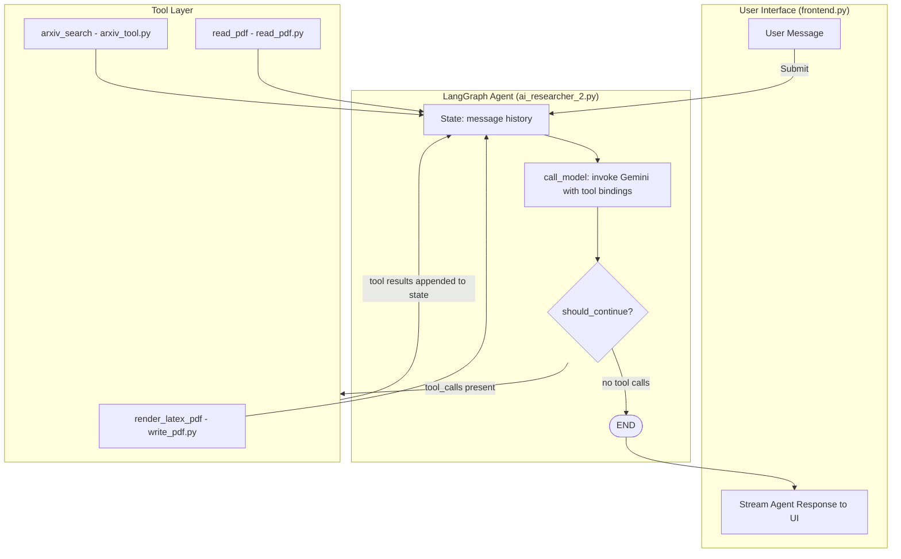

# Research Assistant

An autonomous academic research assistant that searches arXiv, reads papers, synthesizes findings, and renders a publication-style LaTeX PDF. Built to demonstrate stateful LangGraph agent orchestration — not a basic chatbot wrapper.

**Status:** Active prototype  
**Stack:** Python, Streamlit, LangGraph, Gemini, custom PDF tools, Tectonic  
**Focus:** Research workflow automation, streaming UX, tool-driven agents

## Why This Project

Literature review is usually fragmented across search, reading, note-taking, and writing. This project brings those stages into one pipeline so you can move from a research question to a drafted paper without manually stitching together multiple tools.

## Features

- Conversational topic discovery to define the research direction
- Live arXiv paper search via the arXiv Atom API (sorted by most recent)
- PDF reading and content extraction from arXiv paper links
- Stateful multi-turn agent with persistent memory across the conversation
- Two agent modes: simple ReAct agent and advanced StateGraph with MemorySaver checkpointing
- LaTeX paper generation with mathematical equations and reference links
- Tectonic-based LaTeX-to-PDF rendering from within the agent
- Interactive Streamlit UI with streaming responses and markdown formatting

## Tech Stack

- Python 3.11+
- LangGraph for stateful agent graph orchestration
- LangChain Google Generative AI (`langchain-google-genai`) for Gemini models
- Gemini 2.5 Pro / Gemini 2.5 Flash via Google AI API
- arXiv Atom API for paper search
- PyPDF2 for PDF reading
- Tectonic for LaTeX compilation
- Streamlit for the interactive frontend

## Architecture & Implementation Flow

The agent operates in a conversational loop, calling tools as needed and updating its graph state on each turn.



### File Structure

```
frontend.py          <- Streamlit UI, mode selection, streaming renderer
ai_researcher_2.py   <- Advanced StateGraph agent + simple ReAct fallback
ai_researcher.py     <- Standalone CLI version of the ReAct agent
arxiv_tool.py        <- arXiv Atom API search + XML parser + LangChain @tool
read_pdf.py          <- PDF URL fetcher + PyPDF2 text extractor + @tool
write_pdf.py         <- LaTeX writer + Tectonic compiler + @tool
```

## Prerequisites

- A Google AI API key with access to Gemini models — [get one here](https://aistudio.google.com/app/apikey)
- [Tectonic](https://tectonic-typesetting.github.io/) installed and available on your system PATH for PDF rendering

## Setup (UV)

No need to manually create a virtual environment — `uv` handles it.

```bash
# Install dependencies from pyproject.toml
uv sync

# Run the Streamlit app
uv run streamlit run frontend.py
```

## Environment Variables

Copy `.env.example` to `.env` and fill in your values:

```env
GOOGLE_API_KEY=your_gemini_api_key_here
```

Notes:
- `GOOGLE_API_KEY` is required. The agent will not start without it.
- The default model is `gemini-2.5-flash` (Advanced mode) and `gemini-2.5-pro` (CLI mode).

To add a new dependency:
```bash
uv add package_name
```

## Usage

### Streamlit Dashboard (recommended)

```bash
uv run streamlit run frontend.py
```

The dashboard supports two modes:
- **Simple mode** — single-turn ReAct agent, good for quick lookups
- **Advanced mode** — multi-turn StateGraph agent with MemorySaver checkpointing, maintains full conversation history

### CLI (standalone agent)

```bash
uv run python ai_researcher.py
```

Runs a terminal loop using the ReAct agent with Gemini 2.5 Pro.

### Typical Research Workflow

1. Tell the agent your topic of interest (e.g. *"quantum error correction"*)
2. It searches arXiv and returns recent papers with authors, summaries, and PDF links
3. You choose a paper — the agent reads the full PDF content
4. It identifies future research directions and proposes ideas
5. You select one — the agent writes a new research paper in LaTeX with equations and references
6. The paper is compiled and rendered as a downloadable PDF

## Limitations

- **Tectonic dependency**: PDF rendering requires Tectonic to be installed separately. The agent cannot compile LaTeX without it.
- **arXiv only**: The paper search is limited to arXiv. Other databases (Semantic Scholar, PubMed, etc.) are not supported.
- **No persistent storage**: Conversation history is held in memory only and is lost when the app restarts.
- **PDF extraction quality**: PyPDF2 extraction may produce garbled text for papers with complex layouts, equations, or scanned figures.

## Troubleshooting

| Issue | Cause | Fix |
|---|---|---|
| `GOOGLE_API_KEY` missing error | `.env` not set up | Copy `.env.example` to `.env` and add your key |
| PDF rendering fails | Tectonic not installed or not on PATH | Install Tectonic and ensure it is accessible |
| arXiv returns no results | Query contains special characters | Avoid parentheses and quotes in the search topic |
| Agent loops on tool calls | Model confused by ambiguous prompt | Restart session and be more specific in your question |

## Roadmap / Ideas

- Add support for Semantic Scholar and PubMed alongside arXiv
- Persistent session storage (SQLite or file-based checkpointing)
- Inline equation preview in the Streamlit UI
- Export conversation history alongside the generated PDF
- Add citation management (BibTeX generation from arXiv metadata)

## Security Notes

The agent executes tool calls autonomously, including writing and compiling LaTeX files to disk. Run in a sandboxed environment if exposing to untrusted users.

## License

MIT

---
Built with LangGraph, Gemini, and fast Python tooling.
