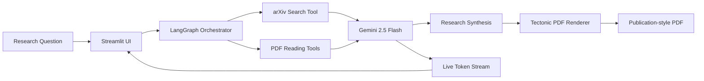
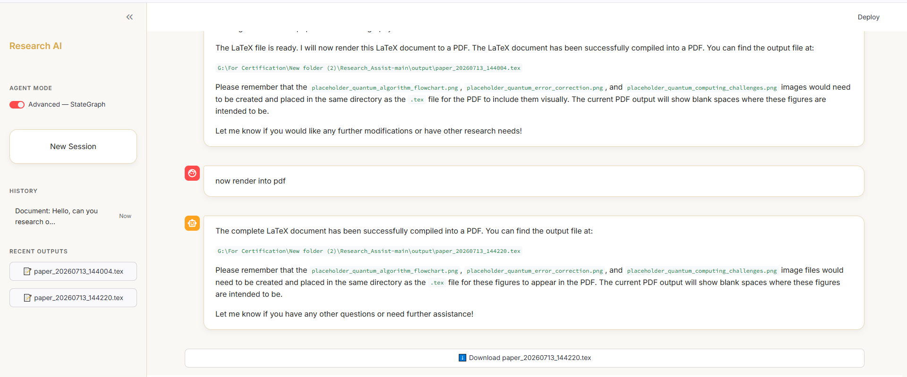

# Research Assistant

An autonomous academic research assistant that searches arXiv, reads papers, synthesizes findings, and renders a publication-style PDF. This project is designed to show stateful agent orchestration rather than a basic chatbot wrapper.

**Status:** Active prototype  
**Stack:** Python, Streamlit, LangGraph, Gemini, custom PDF tools, Tectonic  
**Focus:** Research workflow automation, streaming UX, tool-driven agents

## Why this project

Literature review is usually fragmented across search, reading, note-taking, and writing. This repo brings those stages into one pipeline so the user can move from a research question to a drafted paper without manually stitching together multiple tools.

## Core capabilities

- Search academic papers on arXiv.
- Read and summarize papers with custom PDF tooling.
- Maintain multi-step research state with LangGraph.
- Stream reasoning progress in the UI.
- Compile a polished PDF output through Tectonic.

## Architecture list

1. Input and orchestration layer
   a. Streamlit interface for prompts and streaming output  
   b. LangGraph state machine for tool routing and memory
2. Research tooling layer
   a. arXiv search tool for retrieval  
   b. PDF read/write utilities for paper analysis and report generation
3. Model layer
   a. Gemini 2.5 Flash for structured generation and agent decisions  
   b. Token streaming back to the UI
4. Output layer
   a. Research synthesis in markdown-like intermediate form  
   b. Tectonic PDF rendering for final paper output

## Implementation diagram



## Project structure

```text
Research_Assist/
├── frontend.py         # Streamlit UI
├── ai_researcher.py    # Core agent flow
├── ai_researcher_2.py  # Alternate / iterative agent logic
├── arxiv_tool.py       # arXiv search helper
├── read_pdf.py         # PDF reading utilities
├── write_pdf.py        # PDF writing / rendering helpers
├── pyproject.toml
└── README.md
```

## Why LangGraph here

- A stateless chat loop is weak for long research tasks.
- Research requires memory checkpoints across multiple tool invocations.
- The system benefits from explicit routing between search, reading, synthesis, and document output.

## Local setup

```bash
uv sync
uv run streamlit run frontend.py --browser.gatherUsageStats false
```

Create a `.env` file before running:

```env
GOOGLE_API_KEY=your-api-key-here
```

Ensure `tectonic` is installed or available on your `PATH` for PDF rendering.

## What this demonstrates

- Stateful agent design instead of one-shot prompting
- Custom tool integration for academic workflows
- Streaming-first interface behavior
- End-to-end output generation, not just answer generation

## Demo / Screenshots

<details>
<summary>🖼️ Click to view screenshot</summary>



</details>

<details>
<summary>📄 Click to view sample outputs</summary>

- [📑 Chatlog PDF](assets/Chatlog%20PDF.pdf) — Example research conversation log
- [📝 Generated LaTeX Paper](assets/LLM%20generated%20tex%20of%20the%20Research%20Paper.tex) — LLM-generated research paper in .tex format

</details>

<details>
<summary>🎥 Click to view demo video</summary>

<video src="https://raw.githubusercontent.com/Areshi001/Research_Assist/main/assets/Research_Assist-Demo_Vid.mp4" controls width="100%"></video>
*Research Assistant in action — arXiv search, synthesis, and PDF generation*

</details>

---

## Next improvements

- Stronger citation validation and bibliography formatting
- Better paper-ranking heuristics
- Persistent project workspaces for long-running research sessions
- More explicit evaluation of generated report quality
